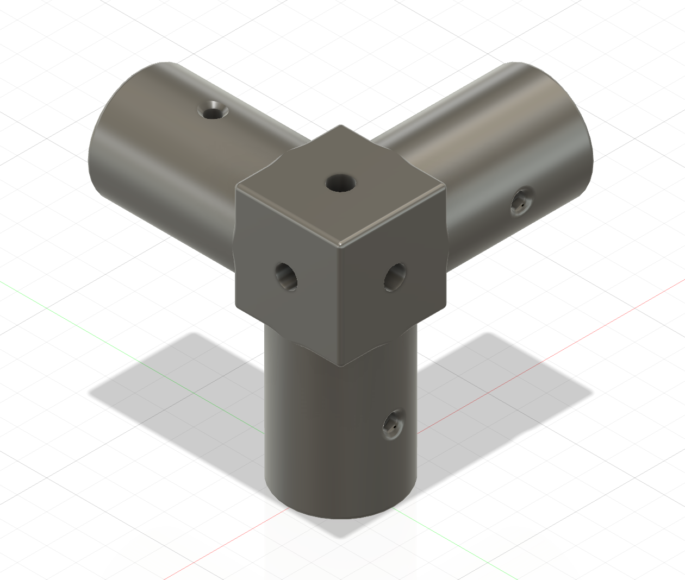
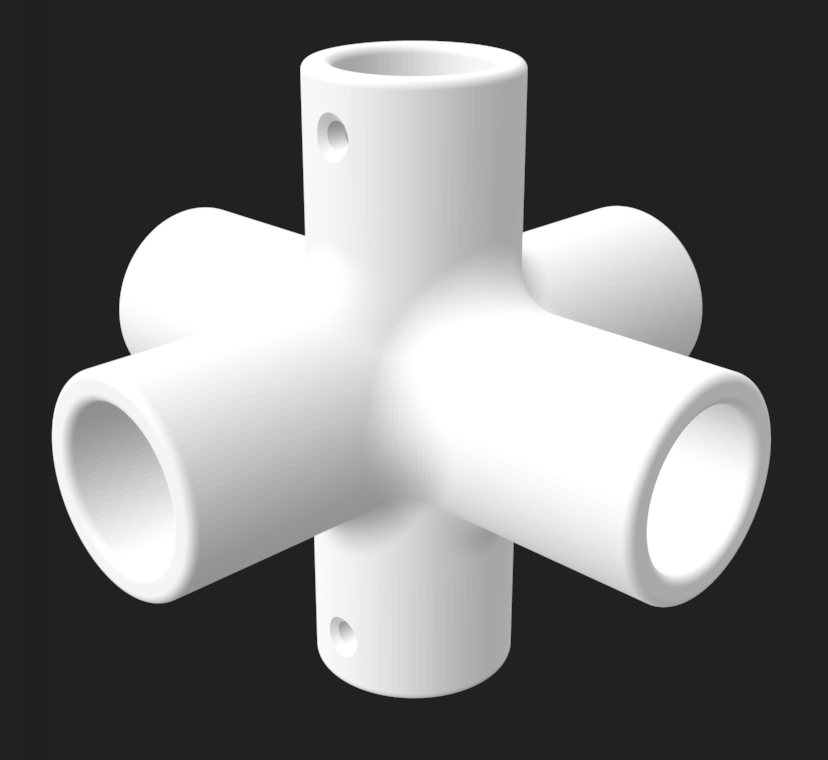
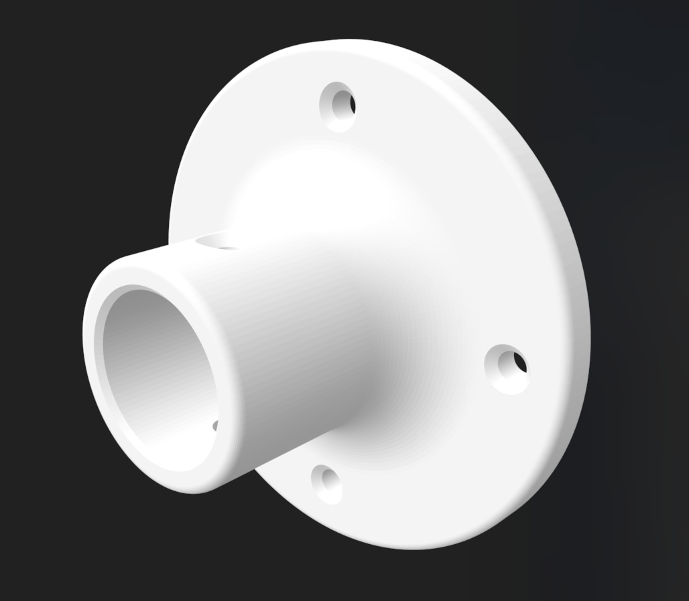
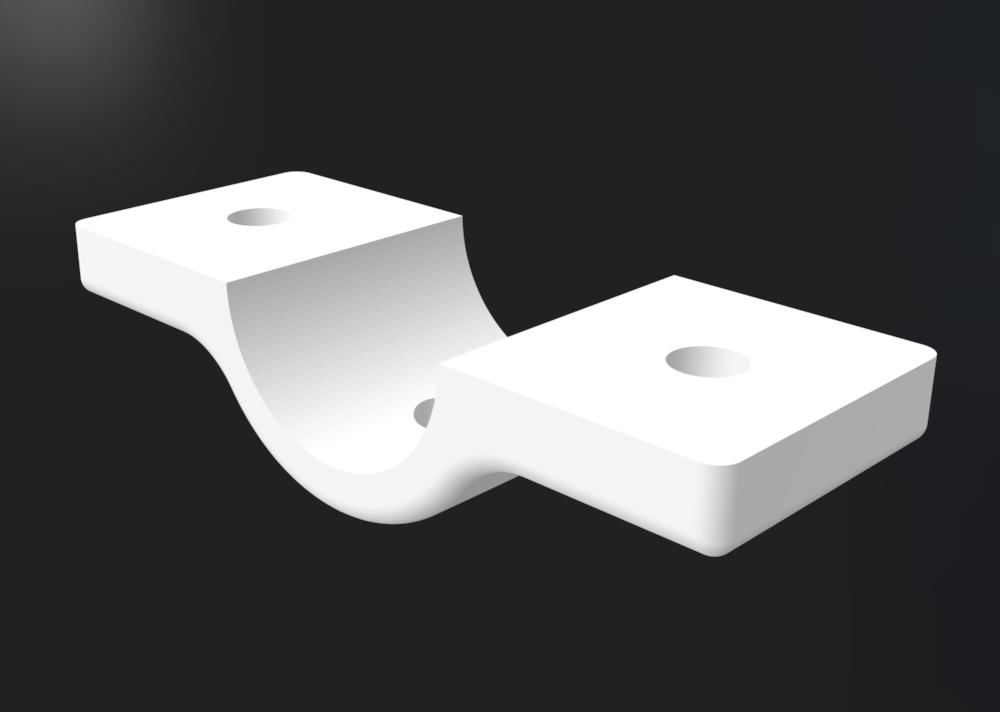
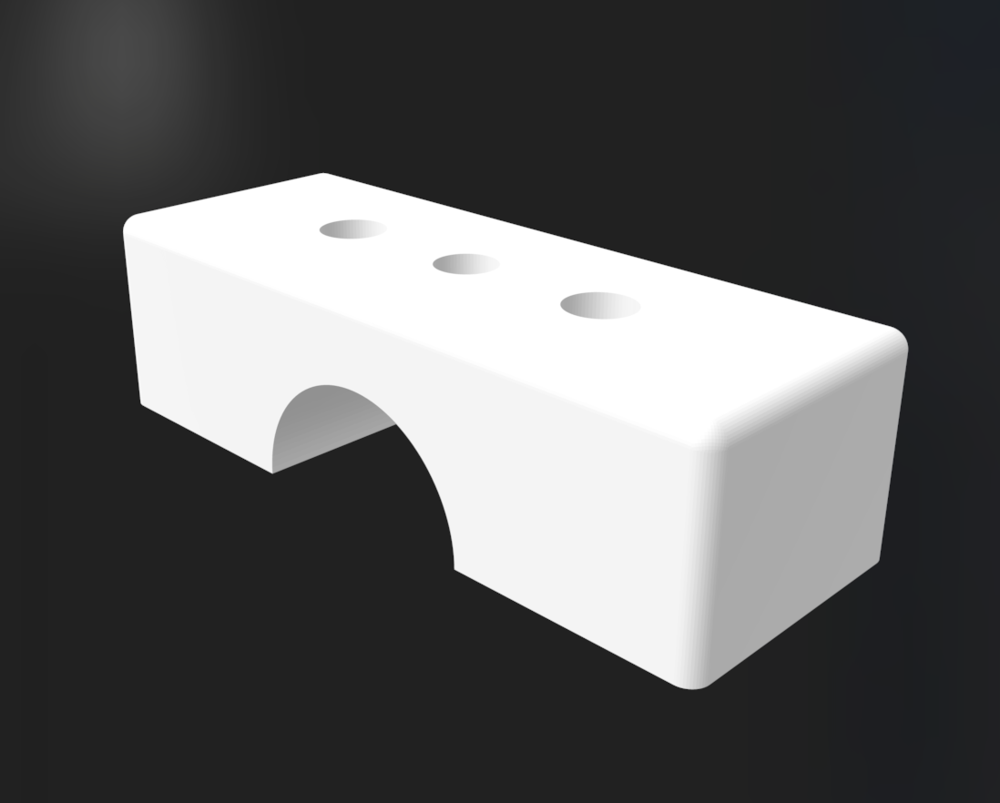

# Le Rail

Robots like the [SO-101](https://huggingface.co/docs/lerobot/en/so101) often benefit from some kind of rigging or workspaces - ways to hold cameras, lights, parts.

This project gives you a way to build simple, cheap structures for holding things with the ethos of cheap, modular, adaptable parts for budget robotics projects.

All of the models below are designed to be 3D printed on an FDM printer.

## Models

| Image | Description |
|-------|-------------|
|  | **Three Way Junction** - A junction that allows you to connect 3 pieces of tubing together. |
|  | **Full Junction** - A simple plus-shaped piece that allows you to connect 2-4 pieces of tubing together. |
|  | **Base** - A base for securing tubing to floors, walls or other surfaces. |
|  | **Camera Clamp** - A clamp for securing a camera to the junction. Uses threaded inserts designed for 1/4"-20 bolts commonly used on cameras. |
|  | **Camera Clamp Part 2** - Additional view of the camera clamp assembly. |

## Supplies
- 3/4" PVC tubing - cheap and easily available (at least in US hardware stores)
- Drywall screws
- For camera clamp: 
    - 1/4"-20 buttonhead bolts
    - 1/4"-20 threaded inserts for 3D printed

## Tools
- Some way to cut PVC tubing. A hacksaw works in a pinchbut the dedicated PVC cutters are easiest.
- Some way to chamfer the tubing or sand down the cuts

## Recipes (WIP)

### SO-101 Workspace

### Simple Backdrop Holder

### Gantry

### Floor to ceiling rigging

### Simple Camera Holder